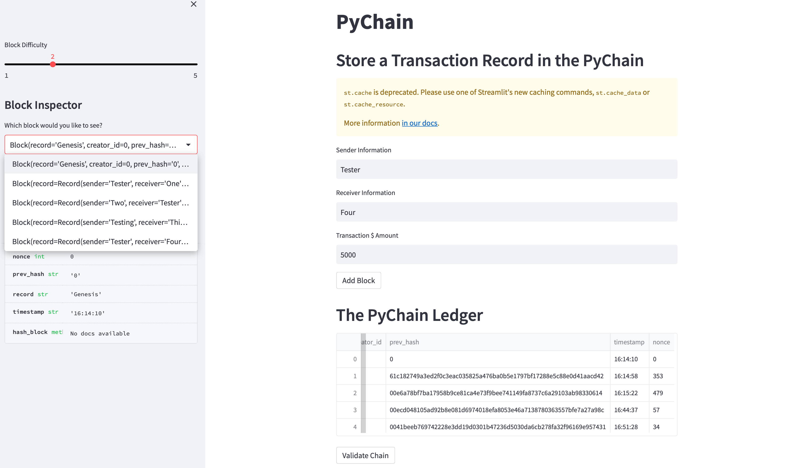
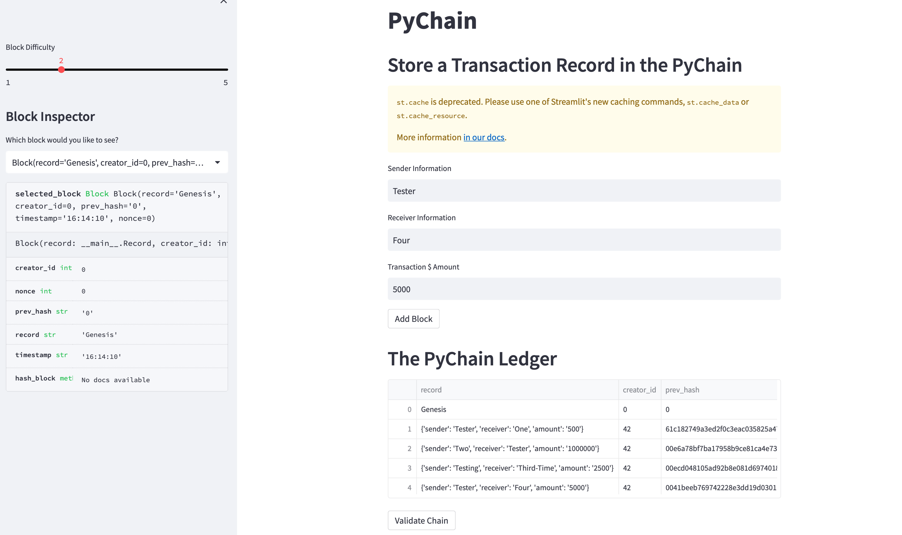
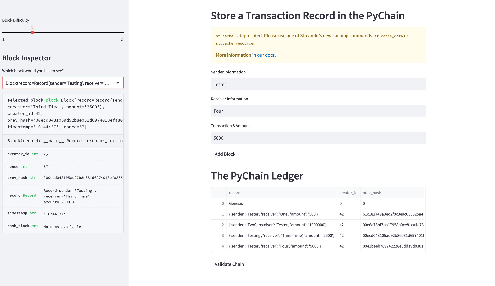
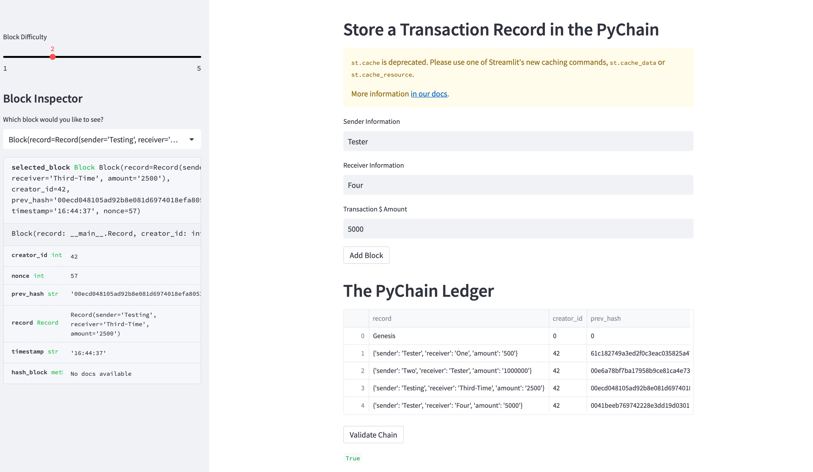

# PyChain Ledger

## Summary of Ledger Additions

* The following Streamlit developed Ledger lets users add the Senders name, Receivers Name and Transaction Amount.  In addition, the program adds the record to the block and validates the record.

* Sample screen shots below show a sample of additions to the Ledger

